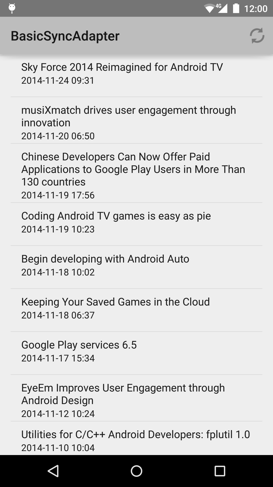

Android BasicSyncAdapter Sample
===================================

This sample demonstrates using SyncAdapter to fetch background
data for an app. It covers the creation of the required Service
that the OS uses to initiate the background data sync as well as
scheduling syncs with background data.

Introduction
------------

This sample demonstrates using SyncAdapter to fetch background data
for an app. SyncAdapters can be used to execute your data transfer
code at configurable intervals, while efficiently using battery and
other system resources.

This sample implements all the required elements of a sync adapter.
- Creates a sync adapter class.
- Creates a bound Service which the OS uses to initiate a sync.
- Defines the sync adapter properties in an XML resource file.
- Declares the bound Service in the app manifest.

For more on SyncAdapters refer to [Transferring Data Using Sync Adapters][1]

[1]: http://developer.android.com/training/sync-adapters/index.html

Pre-requisites
--------------

- Android SDK 25
- Android Build Tools v25.0.3
- Android Support Repository

Screenshots
-------------

 

